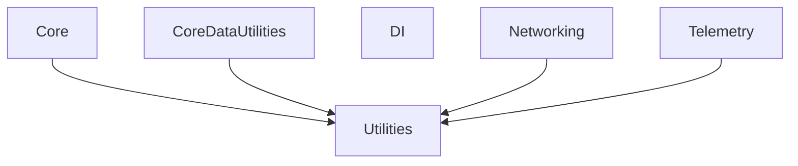

# TruvideoSDK

A modular iOS SDK built with Swift, featuring multiple internal frameworks for different functionalities.

## Table of Contents

- [Project Structure](#project-structure)
- [Prerequisites](#prerequisites)
- [Quick Start](#quick-start)
- [Documentation](#documentation)
- [Coding Style](#coding-style)
- [Code Formatting](#code-formatting)
- [Available Commands](#available-commands)
- [Framework Dependencies](#framework-dependencies)
- [XCFramework Creation](#xcframework-creation)
- [Running Unit Tests](#running-unit-tests)
- [Contributing](#contributing)

## Project Structure

```
truvideo-ios-sdk/
├── Libraries/
│   └── Internal/
│       ├── Core/                 # Core functionality and utilities
│       ├── CoreDataUtilities/    # Core Data helper utilities
│       ├── DI/                   # Dependency injection system
│       ├── Networking/           # Network layer and HTTP client
│       ├── Telemetry/            # Analytics and telemetry system
│       └── Utilities/            # Common utilities and extensions
├── docs/                         # Project documentation
│   └── swift-style-guide.md      # Swift coding standards and guidelines
├── project.yml                   # XcodeGen configuration
├── Makefile                      # Build automation
└── README.md                     # This file
```

## Prerequisites

- **Xcode 15.0+** (iOS 15.0+ deployment target)
- **XcodeGen** - Install via Homebrew: `brew install xcodegen`
- **SwiftLint** - Install via Homebrew: `brew install swiftlint`
- **Make** - Usually pre-installed on macOS

## Quick Start

### 1. Clone the Repository
```bash
git clone git@github.com:Truvideo/truvideo-ios-sdk.git
cd truvideo-ios-sdk
```

### 2. Generate and Build
```bash
# Generate Xcode project, build all frameworks, and open Xcode
make genbuild
```

That's it! The project will be generated, all frameworks built, and Xcode will open automatically.

## Documentation

### 📚 Framework Documentation
Each framework includes comprehensive documentation for its specific functionality:

- **[Core Framework](Libraries/Internal/Core/Sources/Core.docc/Core.md)** - Core functionality and utilities
- **[CoreDataUtilities](Libraries/Internal/CoreDataUtilities/Sources/CoreDataUtilities.docc/CoreDataUtilities.md)** - Core Data helper utilities
- **[DI Framework](Libraries/Internal/DI/Sources/DI.docc/DI.md)** - Dependency injection system
- **[Networking](Libraries/Internal/Networking/Sources/Networking.docc/Networking.md)** - Network layer and HTTP client
- **[Telemetry](Libraries/Internal/Telemetry/Sources/Telemetry.docc/README.md)** - Analytics and telemetry system
- **[Utilities](Libraries/Internal/Utilities/Sources/Utilities.docc/Utilities.md)** - Common utilities and extensions

## Coding Style

See [docs/swift-style-guide.md](docs/swift-style-guide.md) for our comprehensive coding standards and guidelines.

## Code Formatting

To ensure code consistency across the project, we use the official [swift-format](https://github.com/apple/swift-format) tool.

**All code is automatically formatted on build**, but you can also run it manually before creating a pull request (PR):

```bash
swift-format format -r Libraries/Internal -i
```

> **Tip:** You can also format the entire project by running the above command from the project root.

GitHub Actions will verify that any code changes are style-compliant. Please make sure your code is formatted before submitting a PR.

**Install swift-format:**
```bash
brew install swift-format
```

## Available Commands

### 🚀 Quick Start Commands
```bash
make genbuild          # Generate, build, and open Xcode project (recommended)
make generate          # Generate Xcode project using XcodeGen
make open              # Open Xcode project (after generation)
```

### 🔨 Building Commands
```bash
make build             # Build all frameworks in dependency order
make framework SCHEME=<name>  # Build specific framework as XCFramework
# Available schemes: Core, CoreDataUtilities, DI, Networking, Telemetry, Utilities
```

### 🧪 Testing & Quality
```bash
make test              # Run all unit tests
make lint              # Run SwiftLint for code quality checks
```

### 🛠️ Development Workflows
```bash
make dev               # Clean, generate, and build (development reset)
make all               # Generate, build, and test (full CI workflow)
make clean             # Clean all generated files and build artifacts
```

### 📚 Help & Information
```bash
make help              # Show all available commands with descriptions
```

> **Pro Tip:** Start with `make genbuild` for a complete setup, then use `make framework SCHEME=<name>` for individual framework development.

## Framework Dependencies



The diagram above shows the dependency relationships between frameworks. **Utilities** is the foundational module, while **DI** is completely independent.

## XCFramework Creation

The `make framework SCHEME=<name>` command creates XCFrameworks that work on both device and simulator:

```bash
make framework SCHEME=Core
```

This will:
1. Build the framework for device (iphoneos)
2. Build the framework for simulator (iphonesimulator)
3. Create an XCFramework in `DerivedData/XCFrameworks/`

## Running Unit Tests

Select a scheme and press <kbd>Command</kbd>+<kbd>U</kbd> in Xcode to build a component and run its unit tests.


## Contributing

See [CONTRIBUTING.md](CONTRIBUTING.md) for more information on contributing to the Truvideo iOS SDK.

